## v1.9.50 - 2025-09-29
## Version 1.9.50

### Changes
- **Module Import Path**: Corrected the import path for `ExternalFulfillment` to ensure proper module loading and usage.

  ```mermaid
  graph TD;
      A[Client] --> B[sp_api.api.external_fulfillment.external_fulfillment];
  ```

### Internal
- Updated version number from 1.9.49 to 1.9.50 in `__version__.py`.

## v1.9.49 - 2025-09-29
## Version 1.9.49

### New Features
- **External Fulfillment API**: Added a new module `ExternalFulfillment` to the package. This module is now available for import and use in your projects.

  ```mermaid
  graph TD;
      A[Client] --> B[ExternalFulfillment];
  ```

### Changes
- **Dependencies**: Updated the `boto3` dependency from `1.40.21` to `1.40.40` to ensure compatibility and leverage the latest features and fixes.

### Internal
- Added `sp_api.api.external_fulfillment` to the list of packages in `setup.py`.
- Updated version number from 1.9.48 to 1.9.49.

## v1.9.48 - 2025-09-03
## Version 1.9.48

### New Features
- **Fulfillment Inbound API**: Introduced the `update_shipment_name` method in the `FulfillmentInbound` class. This method allows users to update the name of an existing shipment. It accepts the following parameters:
  - `inboundPlanId`: Identifier for the inbound plan.
  - `shipmentId`: Identifier for the shipment.
  - `body`: A dictionary containing the new name for the shipment.

  ```mermaid
  graph TD;
      A[Client] --> B[update_shipment_name];
      B --> C[inboundPlanId];
      B --> D[shipmentId];
      B --> E[body];
  ```

### Changes
- **Dependencies**: Updated the following dependencies:
  - `boto3` from `1.40.15` to `1.40.21`

### Internal
- Removed unnecessary test package entries from `setup.py`.
- Updated version number from 1.9.47 to 1.9.48.

## v1.9.47 - 2025-08-25
# Changelog

## Version 1.9.47

### New Features
- **Fulfillment Inbound API**: Added a new method `update_shipment_name` to the `FulfillmentInbound` class. This method allows updating the name of an existing shipment. It supports the following parameters:
  - `inboundPlanId`: Identifier for the inbound plan.
  - `shipmentId`: Identifier for the shipment.
  - `body`: A dictionary containing the new name for the shipment.

  ```mermaid
  graph TD;
      A[Client] --> B[update_shipment_name];
      B --> C[inboundPlanId];
      B --> D[shipmentId];
      B --> E[body];
  ```

### Changes
- **Dependencies**: Updated the following dependencies:
  - `requests` from `2.32.4` to `2.32.5`
  - `boto3` from `1.39.14` to `1.40.15`

### Internal
- Updated version number from 1.9.46 to 1.9.47.

## v1.9.46 - 2025-07-28
# Changelog

## Version 1.9.46

### New Features
- No new features added in this release.

### Bug Fixes
- No bug fixes included in this release.

### Changes
- Updated version number from 1.9.45 to 1.9.46.

### Internal
- No internal changes relevant to end-users. 

### Diagrams
- No changes requiring diagrams in this release.

## v1.9.40 - 2025-07-26
## Version 1.9.40

### Changes Relevant to Users

- **New Feature**
  - Added `send_invoice` method in the `messaging` module. This method allows users to send an invoice message to buyers for a specified order. The method supports sending attachments as part of the message.

- **Dependency Updates**
  - Upgraded `boto3` dependency from `1.38.42` to `1.39.13` in both `requirements.txt` and `docs/requirements.txt`. This update includes the latest features and bug fixes from AWS services.

### Internal Changes

- **Version Update**
  - Incremented version number to `1.9.40` in `sp_api/__version__.py`.

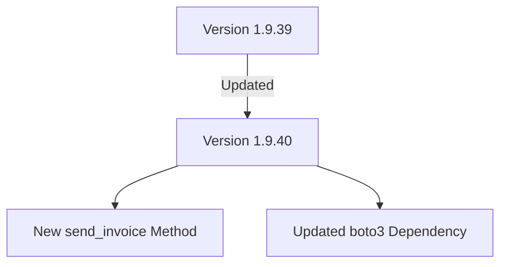

This release introduces the ability to send invoice messages directly through the API, enhancing communication capabilities with buyers. Additionally, it ensures compatibility with the latest AWS services by updating the `boto3` dependency.

## v1.9.39 - 2025-06-24
## Version 1.9.39

### Changes Relevant to Users

- **Dependency Updates**
  - Upgraded `boto3` dependency from `1.38.40` to `1.38.42` in both `requirements.txt` and `docs/requirements.txt`. This update ensures continued compatibility with AWS services and incorporates the latest enhancements.
  - Upgraded `setuptools` from `77.0.3` to `80.9.0` to include the latest improvements and bug fixes.

### Internal Changes

- **Version Update**
  - Incremented version number to `1.9.39` in `sp_api/__version__.py`.

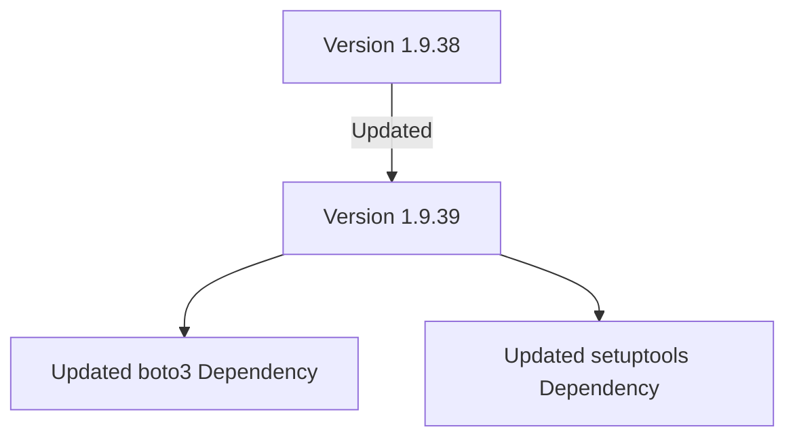

This release focuses on maintaining compatibility with AWS services by updating the `boto3` dependency to its latest version and includes improvements from the updated `setuptools` package.

## v1.9.38 - 2025-06-21
## Version 1.9.38

### Changes Relevant to Users

- **Dependency Updates**
  - Upgraded `boto3` dependency from `1.38.36` to `1.38.40` in both `requirements.txt` and `docs/requirements.txt`. This update ensures continued compatibility with AWS services and incorporates the latest enhancements.

### Internal Changes

- **Version Update**
  - Incremented version number to `1.9.38` in `sp_api/__version__.py`.

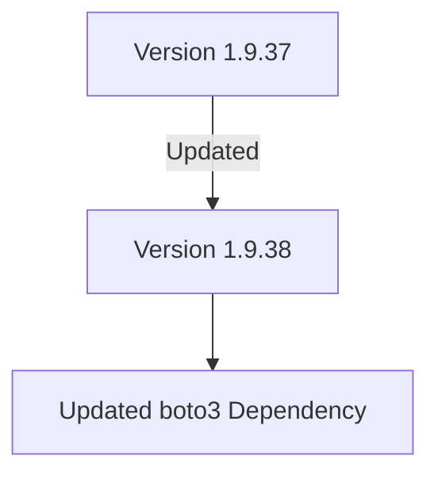

This release focuses on maintaining compatibility with AWS services by updating the `boto3` dependency to its latest version.

## v1.9.37 - 2025-06-16
## Version 1.9.37

### Changes Relevant to Users

- **New Report Type**
  - Added `GET_DATE_RANGE_FINANCIAL_HOLDS_DATA` to `ReportType`. This new report type allows users to access financial hold data within a specified date range, enhancing financial data analysis capabilities.

- **Dependency Updates**
  - Upgraded `boto3` dependency from `1.38.31` to `1.38.36` in both `requirements.txt` and `docs/requirements.txt`. This ensures compatibility with the latest AWS features and improvements.
  - Updated `requests` dependency from `2.32.3` to `2.32.4`. This update includes minor bug fixes and performance improvements.

### Internal Changes

- **Version Update**
  - Incremented version number to `1.9.37` in `sp_api/__version__.py`.

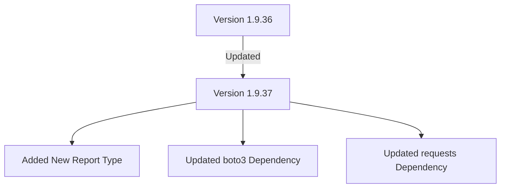

This release introduces a new report type for enhanced financial data analysis and includes updates to key dependencies to maintain compatibility and leverage the latest improvements.

## v1.9.36 - 2025-06-06
## Version 1.9.36

### Changes Relevant to Users

- **Dependency Update**
  - Upgraded `boto3` dependency from `1.38.29` to `1.38.31` in both `requirements.txt` and `docs/requirements.txt`. This update ensures users have access to the latest features and improvements provided by `boto3`.

### Internal Changes

- **Version Update**
  - Incremented version number to `1.9.36` in `sp_api/__version__.py`.

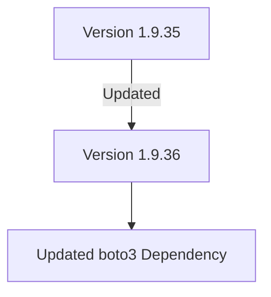

This release focuses on maintaining compatibility and leveraging the latest improvements in dependencies to ensure optimal performance and stability.

## v1.9.35 - 2025-06-04
## Version 1.9.35

### Changes Relevant to Users

- **New Feature**
  - Introduced a `timeout` parameter to the `get_report_document` method in the `Reports` class. This feature allows users to specify a timeout for requests when downloading documents, providing enhanced control over network operations.

### Internal Changes

- **Dependency Update**
  - Updated `boto3` dependency from `1.38.28` to `1.38.29` in both `requirements.txt` and `docs/requirements.txt` to ensure compatibility and access to the latest features and bug fixes.

- **Version Update**
  - Incremented version number to `1.9.35` in `sp_api/__version__.py`.

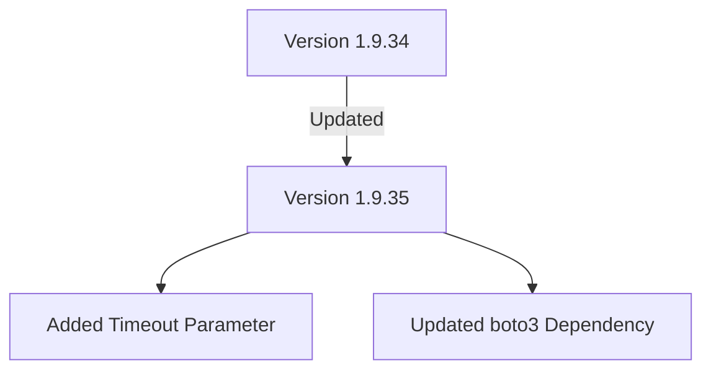

This release enhances network request handling capabilities and updates a key dependency to improve overall package stability and functionality.

## v1.9.34 - 2025-06-03
## Version 1.9.34

### Changes Relevant to Users

- **New Feature**
  - Added a `timeout` parameter to the `get_report_document` method in the `Reports` class. This allows users to specify a timeout for the request when downloading a document, enhancing control over network operations.

### Internal Changes

- **Dependency Update**
  - Updated `boto3` dependency from `1.38.17` to `1.38.28` in both `requirements.txt` and `docs/requirements.txt` to ensure compatibility and access to the latest features and bug fixes.

- **Version Update**
  - Incremented version number to `1.9.34` in `sp_api/__version__.py`.

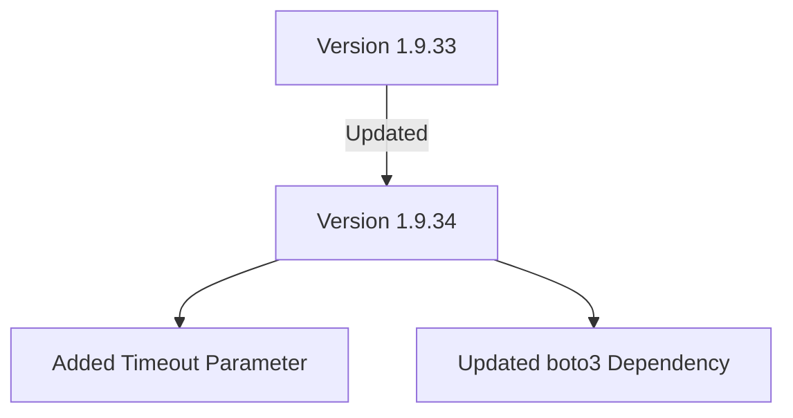

This release introduces a new feature for enhanced network request handling and updates a key dependency to improve overall package stability and functionality.

## v1.9.33 - 2025-05-16
## Version 1.9.33

### Changes Relevant to Users

- **Documentation Update**
  - Enhanced the README to acknowledge community feedback on implementing Pydantic and async support for the upcoming version 2.0. Acknowledgment to contributors who participated in the voting process.

### Internal Changes

- **Version Update**
  - Incremented version number to `1.9.33` in `sp_api/__version__.py`.

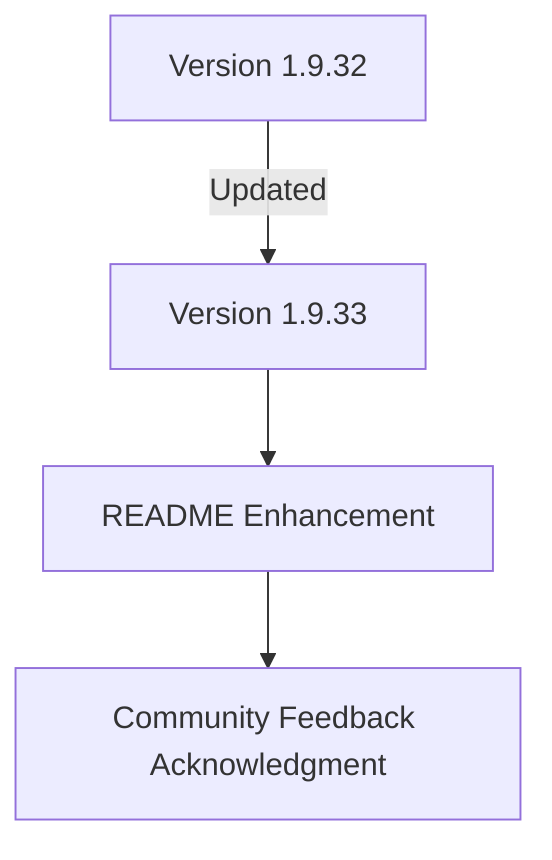

This update continues to prepare for version 2.0 by incorporating community insights and setting the stage for future enhancements, including Pydantic and async support.

## v1.9.32 - 2025-05-16
## Version 1.9.32

### Changes Relevant to Users

- **Documentation Update**
  - Updated the README to reflect the community's decision to implement Pydantic and async support in the upcoming version 2.0. Contributors are encouraged to join the ongoing discussion on GitHub.

### Internal Changes

- **Version Update**
  - Incremented version number to `1.9.32` in `sp_api/__version__.py`.

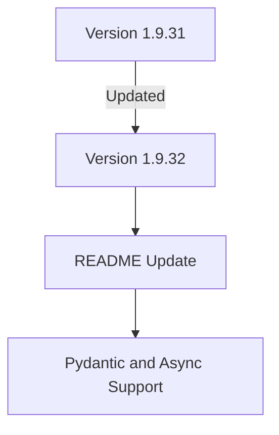

This update prepares the groundwork for version 2.0 by aligning community feedback with planned features, including Pydantic and async support.

## v1.9.31 - 2025-05-16
## Version 1.9.31

### Changes Relevant to Users

- **Bug Fixes**
  - Corrected a typo in the `grantless_scope` attribute of the `ApplicationManagement` class from `sellingpartnetapi::client_credential:rotation` to `sellingpartnerapi::client_credential:rotation`. This ensures proper functionality when using the grantless scope for client credential rotation.

### Internal Changes

- **Version Update**
  - Incremented version number to `1.9.31` in `sp_api/__version__.py`.

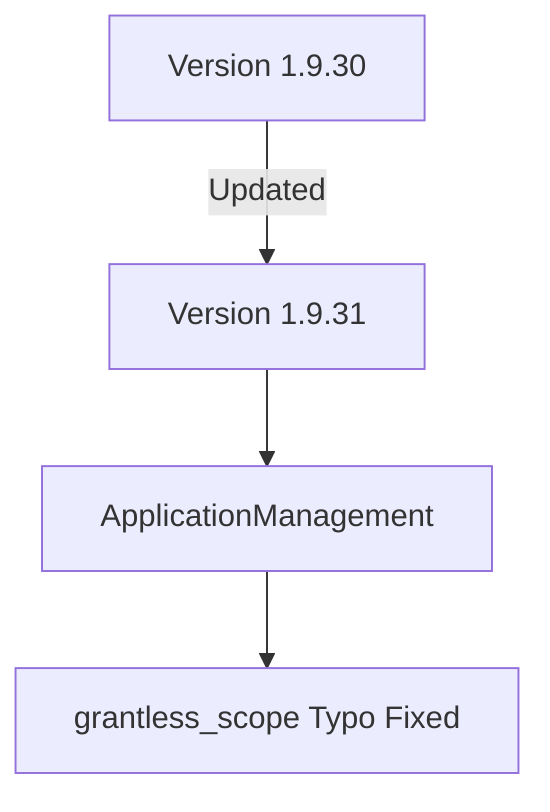

This update fixes a typo in the `ApplicationManagement` API, ensuring that the correct grantless scope is used for client credential rotations.

## v1.9.30 - 2025-05-16
## Version 1.9.30

### Changes Relevant to Users

- **New Features**
  - Added `grantless_scope` attribute to `ApplicationManagement` class, enabling the use of the `sellingpartnerapi::client_credential:rotation` scope for client credential rotation.

- **Bug Fixes**
  - Updated the `rotate_application_client_secret` method to use `_request_grantless_operation`, ensuring proper handling of grantless operations.

### Internal Changes

- **Version Update**
  - Incremented version number to `1.9.30` in `sp_api/__version__.py`.

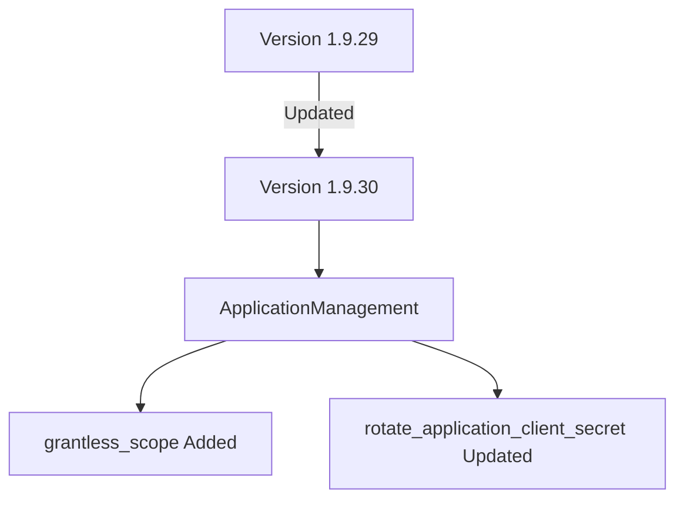

These updates enhance the functionality of the `ApplicationManagement` API, allowing for more seamless client secret rotations and improving the handling of grantless operations.

## v1.9.29 - 2025-05-16
## Version 1.9.29

### Changes Relevant to Users

- **Enhancements**
  - Updated the `boto3` dependency from `1.38.1` to `1.38.17` in both `requirements.txt` and `docs/requirements.txt` to ensure compatibility with the latest features and improvements.

### Internal Changes

- **Documentation Updates**
  - Updated the service link in `README.md` to reflect the new URL for real-time alerts and report downloads.

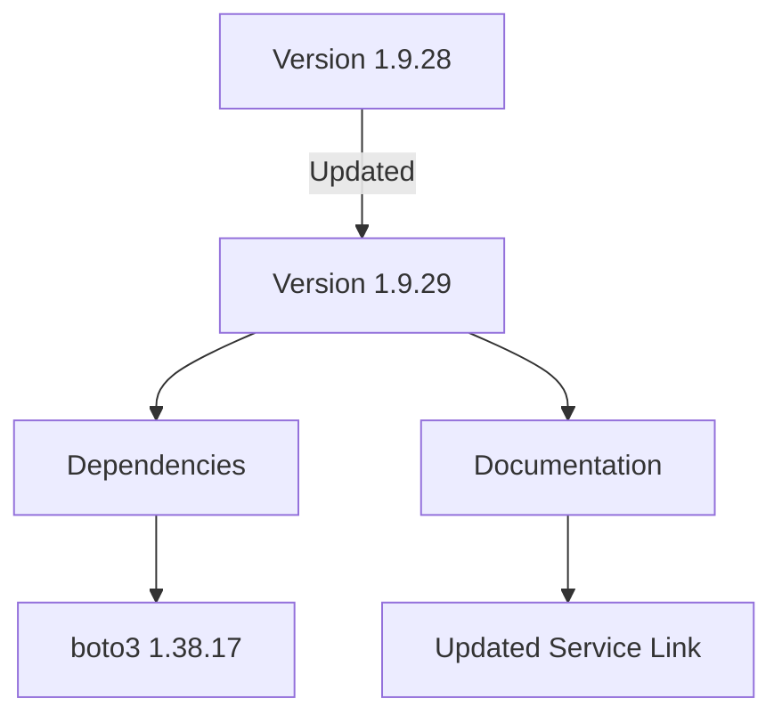

These updates ensure the package remains up-to-date with the latest `boto3` enhancements and provide users with the correct service information for accessing real-time alerts and report downloads.

## v1.9.28 - 2025-04-24
## Version 1.9.28

### Changes Relevant to Users

- **New Features**
  - Introduced the `ApplicationIntegrations` class in the API, which includes methods to manage notifications for Amazon Selling Partners:
    - `create_notification`: Allows creating notifications for sellers in Seller Central.
    - `delete_notifications`: Enables the removal of application notifications from the Appstore notifications dashboard.
    - `record_action_feedback`: Records the seller's response to a notification.
  - Added documentation for the new `application_integrations` endpoint.

- **Enhancements**
  - Updated the `boto3` dependency from `1.37.34` to `1.38.1` in both `requirements.txt` and `docs/requirements.txt`.

### Internal Changes

- **Documentation Updates**
  - Added a new documentation file for `application_integrations` in `docs/endpoints/application_integrations.rst`.

- **Code Maintenance**
  - Modified `make_endpoint/make_docs.py` and `make_endpoint/make_endpoint` scripts to include the new `application_integrations` endpoint.

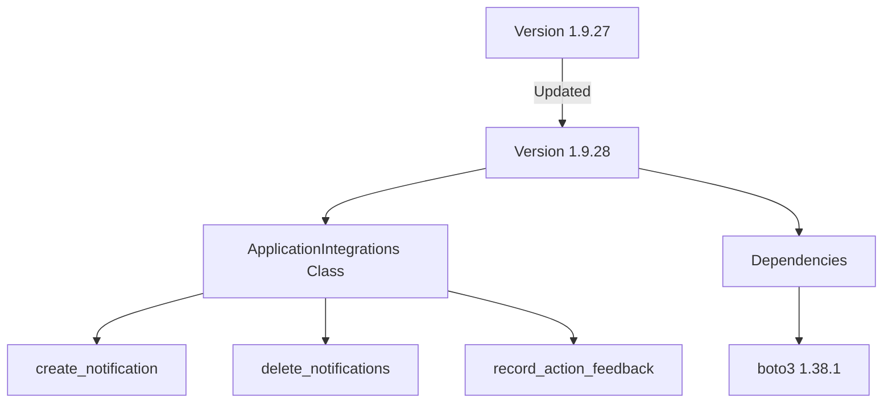

These updates introduce new capabilities for managing notifications via the `ApplicationIntegrations` API, enhancing the ability to interact with Amazon's Selling Partner API. Additionally, the dependency update ensures compatibility with the latest `boto3` version.

## v1.9.27 - 2025-04-16
## Version 1.9.27

### Changes Relevant to Users

- **New Features**
  - Added `get_featured_offer_expected_price_batch` method in the `Products` class. This method allows users to retrieve the featured offer expected price (FOEP) for a batch of requests. The FOEP is the price at or below which a seller can expect to become the featured offer.
  - Introduced `get_competitive_summary_batch` method in the `Products` class. This method provides a competitive summary response, including featured buying options for a given ASIN and marketplace combination.

- **Enhancements**
  - Updated the `products.py` and `products_definitions.py` to include new data classes and enums for handling batch requests and competitive summaries.

### Internal Changes

- **Dependency Updates**
  - Updated `boto3` dependency from `1.37.32` to `1.37.34` in both `requirements.txt` and `docs/requirements.txt`.

- **Version Bump**
  - Updated the package version from `1.9.26` to `1.9.27`.

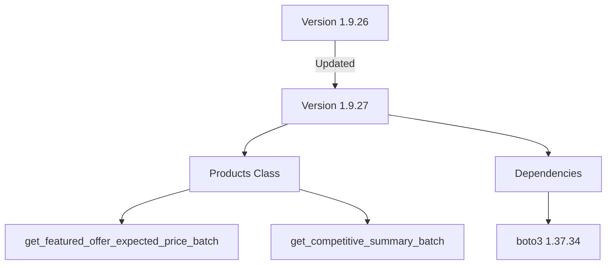

These updates enhance the functionality of the `Products` API by providing new methods for batch processing and competitive analysis, while also ensuring compatibility with the latest `boto3` version.

## v1.9.26 - 2025-04-11
## Version 1.9.26

### Changes Relevant to Users

- **Documentation Update**
  - Updated the appointment link in the README to a new URL for scheduling appointments. This change ensures users are directed to the correct scheduling page.

### Internal Changes

- **Version Bump**
  - Updated the package version from `1.9.25` to `1.9.26`.

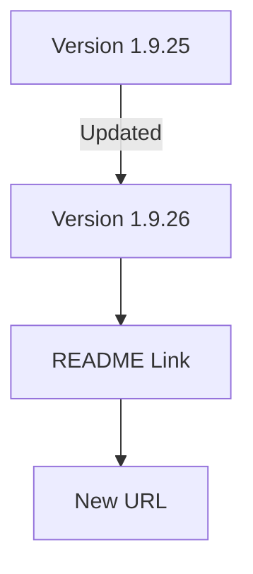

These changes aim to improve user experience by ensuring accurate and up-to-date documentation.

## v1.9.25 - 2025-04-11
## Version 1.9.25

### Changes Relevant to Users

- **Dependency Updates**
  - Updated `boto3` from version `1.37.17` to `1.37.32`. This update ensures compatibility with the latest AWS features and improvements.

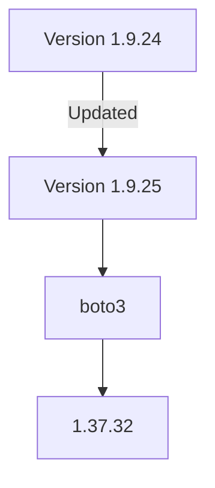

### Internal Changes

- No internal changes were made in this release.

These updates aim to maintain the robustness and compatibility of the `python-amazon-sp-api` package with the latest tools and libraries.

## v1.9.24 - 2025-03-22
## Version 1.9.24

### Changes Relevant to Users

- **Pagination Enhancements**
  - Improved the `ApiResponse` class to better handle pagination by adding support for an additional `nextToken` key in the response payload. This enhancement ensures more reliable navigation through paginated data.

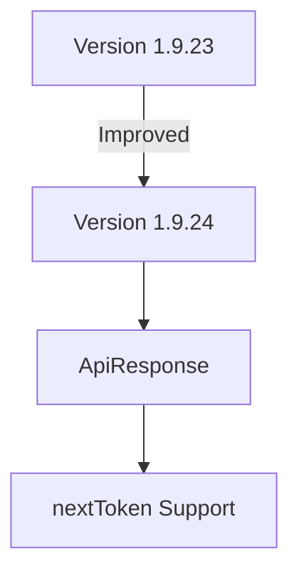

### Internal Changes

- **Code Quality Improvements**
  - Minor formatting adjustments in `load_all_pages.py` to enhance code readability and maintain consistency.

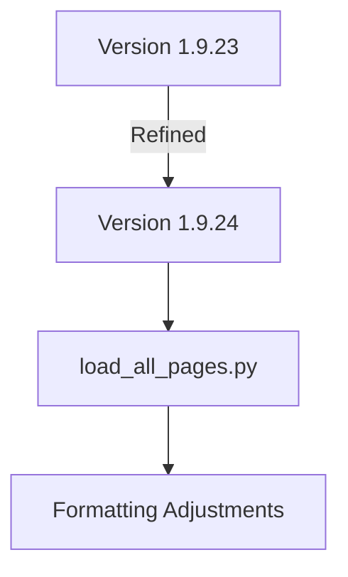

These changes aim to improve the overall functionality and maintainability of the `python-amazon-sp-api` package, ensuring a smoother experience for developers interacting with Amazon's Selling Partner API.

## v1.9.23 - 2025-03-21
## Version 1.9.23

### New Features

- **Finances API Enhancements**
  - Introduced versioning support for the `Finances` client, allowing users to specify API versions when interacting with financial endpoints.
  - Added a new `list_transactions` endpoint to the `Finances` client for retrieving transaction details.

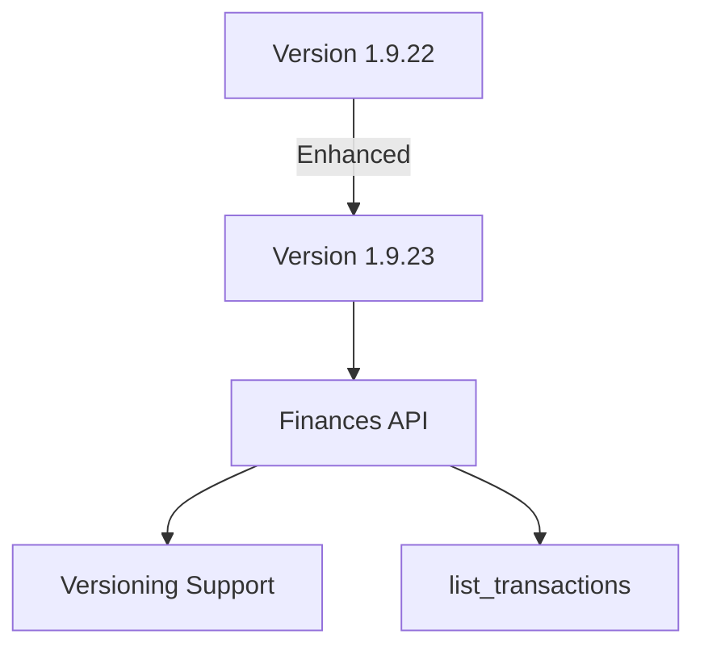

### Internal Changes

- **Dependencies Update**
  - Updated `boto3` library dependency from `~=1.37.14` to `~=1.37.17` to ensure compatibility with the latest features and security patches.
  - Updated `setuptools` library dependency from `~=75.8.2` to `~=77.0.3`.

```mermaid
graph TD;
    A[Version 1.9.22] -->|Updated| B[Version 1.9.23];
    B --> C[boto3 ~=1.37.17];
    A --> D[boto3 ~=1.37.14];
    B --> E[setuptools ~=77.0.3];
    A --> F[setuptools ~=75.8.2];


## v1.9.22 - 2025-03-18
## Version 1.9.22

### New Features

- **Finances API Enhancements**
  - Introduced versioning support for the `Finances` client, allowing users to specify API versions when interacting with financial endpoints.
  - Added a new `list_transactions` endpoint to the `Finances` client for retrieving transaction details.

```mermaid
graph TD;
    A[Version 1.9.21] -->|Enhanced| B[Version 1.9.22];
    B --> C[Finances API];
    C --> D[Versioning Support];
    C --> E[list_transactions];
```

### Internal Changes

- **Dependencies Update**
  - Updated `boto3` library dependency from `~=1.37.12` to `~=1.37.14` to ensure compatibility with the latest features and security patches.

```mermaid
graph TD;
    A[Version 1.9.21] -->|Updated| B[Version 1.9.22];
    B --> C[boto3 ~=1.37.14];
    A --> D[boto3 ~=1.37.12];


## v1.9.21 - 2025-03-14
## Version 1.9.21

### New Features

- **Easy Ship API Integration**
  - Introduced a new `EasyShip` client in the `sp_api.api` module, allowing users to manage and ship Amazon Easy Ship orders.
  - Added several new endpoints under the `EasyShip` client:
    - `list_handover_slots`: Retrieve available time slots for scheduling Easy Ship orders.
    - `get_scheduled_package`: Get detailed information about a scheduled package.
    - `create_scheduled_package`: Schedule an Easy Ship order and obtain package information.
    - `update_scheduled_packages`: Update the time slot for a scheduled package.
    - `create_scheduled_package_bulk`: Schedule multiple Easy Ship orders and generate shipping labels in bulk.

```mermaid
graph TD;
    A[Version 1.9.20] -->|Added| B[Version 1.9.21];
    B --> C[EasyShip API];
    C --> D[list_handover_slots];
    C --> E[get_scheduled_package];
    C --> F[create_scheduled_package];
    C --> G[update_scheduled_packages];
    C --> H[create_scheduled_package_bulk];
```

### Internal Changes

- **Dependencies Update**
  - Updated `requests` library dependency from `>=2.32.0` to `>=2.32.1` to ensure compatibility with the latest features and security patches.

```mermaid
graph TD;
    A[Version 1.9.20] -->|Updated| B[Version 1.9.21];
    B --> C[Requests >=2.32.1];
    A --> D[Requests >=2.32.0];


## v1.9.20 - 2025-03-14
# Changelog

## Version 1.9.20

### Internal Changes

- **Dependencies Update**
  - Updated `requests` library dependency from `>=2.32.0` to `>=2.32.1`.

```mermaid
graph TD;
    A[Version 1.9.19] -->|Updated| B[Version 1.9.20];
    B --> C[Requests >=2.32.1];
    A --> D[Requests >=2.32.0];
```

This update ensures compatibility with the latest features and security patches of the `requests` library.

## v1.9.18 - 2025-02-27
## v1.9.18

### Changes Relevant to End-Users
- **New Report Types**: Added support for new brand analytics report types in the `ReportType` enum:
  - `GET_BRAND_ANALYTICS_SEARCH_CATALOG_PERFORMANCE_REPORT`
  - `GET_BRAND_ANALYTICS_SEARCH_QUERY_PERFORMANCE_REPORT`

### Internal Changes
- **Dependency Updates**: Updated dependencies for improved performance and security:
  - `boto3` updated from `1.37.0` to `1.37.2`
  - `setuptools` updated from `75.8.0` to `75.8.2`

### Mermaid Diagram Representation

```mermaid
graph TD;
    A[ReportType Enum] -->|Added| B[GET_BRAND_ANALYTICS_SEARCH_CATALOG_PERFORMANCE_REPORT];
    A -->|Added| C[GET_BRAND_ANALYTICS_SEARCH_QUERY_PERFORMANCE_REPORT];
    D[Dependencies] -->|Updated| E[boto3, setuptools];
```

This release introduces new report types for enhanced brand analytics capabilities and updates dependencies for better stability and security.

## v1.9.17 - 2025-02-26
## v1.9.17

### Changes Relevant to End-Users
- **API Endpoint Update**: The `list_packing_group_items` method in the `FulfillmentInbound` class now requires a `packingGroupId` parameter. This change ensures more precise retrieval of packing group items by specifying the packing group directly.

### Internal Changes
- **Dependency Updates**: Updated several dependencies to their latest versions for improved performance and security:
  - `boto3` updated from `1.36.15` to `1.37.0`
  - `cachetools` updated from `5.5.1` to `5.5.2`

### Mermaid Diagram Representation

```mermaid
graph TD;
    A[FulfillmentInbound Class] -->|Updated| B[list_packing_group_items Method];
    B -->|Added Parameter| C[packingGroupId];
    D[Dependencies] -->|Updated| E[boto3, cachetools];
```

This release includes an important API endpoint update for more precise data retrieval and updates to dependencies for enhanced stability and security.

## v1.9.16 - 2025-02-26
## v1.9.16

### Changes Relevant to End-Users
- **API Endpoint Update**: The `list_packing_group_items` method in the `FulfillmentInbound` class now requires a `packingGroupId` parameter. This change ensures more precise retrieval of packing group items by specifying the packing group directly.

### Internal Changes
- **Dependency Updates**: Updated several dependencies to their latest versions for improved performance and security:
  - `boto3` updated from `1.36.15` to `1.37.0`
  - `cachetools` updated from `5.5.1` to `5.5.2`

### Mermaid Diagram Representation

```mermaid
graph TD;
    A[FulfillmentInbound Class] -->|Updated| B[list_packing_group_items Method];
    B -->|Added Parameter| C[packingGroupId];
    D[Dependencies] -->|Updated| E[boto3, cachetools];
```

This release includes an important API endpoint update for more precise data retrieval and updates to dependencies for enhanced stability and security.

## v1.9.15 - 2025-02-26
## v1.9.15

### Changes Relevant to End-Users
- **API Endpoint Update**: The `list_packing_group_items` method in the `FulfillmentInbound` class now requires a `packingGroupId` parameter. This change ensures more precise retrieval of packing group items by specifying the packing group directly.

### Internal Changes
- **Dependency Updates**: Updated several dependencies to their latest versions for improved performance and security:
  - `boto3` updated from `1.36.15` to `1.37.0`
  - `cachetools` updated from `5.5.1` to `5.5.2`

### Mermaid Diagram Representation

```mermaid
graph TD;
    A[FulfillmentInbound Class] -->|Updated| B[list_packing_group_items Method];
    B -->|Added Parameter| C[packingGroupId];
    D[Dependencies] -->|Updated| E[boto3, cachetools];
```

This release includes an important API endpoint update for more precise data retrieval and updates to dependencies for enhanced stability and security.

## v1.9.14 - 2025-02-26
## v1.9.14

### Changes Relevant to End-Users
- **API Endpoint Update**: The `list_packing_group_items` method in the `FulfillmentInbound` class now requires a `packingGroupId` parameter. This change ensures more precise retrieval of packing group items by specifying the packing group directly.

### Internal Changes
- **Dependency Updates**: Updated several dependencies to their latest versions for improved performance and security:
  - `boto3` updated from `1.36.15` to `1.37.0`
  - `cachetools` updated from `5.5.1` to `5.5.2`

### Mermaid Diagram Representation

```mermaid
graph TD;
    A[FulfillmentInbound Class] -->|Updated| B[list_packing_group_items Method];
    B -->|Added Parameter| C[packingGroupId];
    D[Dependencies] -->|Updated| E[boto3, cachetools];
```

This release includes an important API endpoint update for more precise data retrieval and updates to dependencies for enhanced stability and security.

## v1.9.13 - 2025-02-26
## v1.9.13

### Changes Relevant to End-Users
- **API Endpoint Update**: The `list_packing_group_items` method in the `FulfillmentInbound` class now requires a `packingGroupId` parameter. This change ensures more precise retrieval of packing group items by specifying the packing group directly.

### Internal Changes
- **Dependency Updates**: Updated several dependencies to their latest versions for improved performance and security:
  - `boto3` updated from `1.36.15` to `1.37.0`
  - `cachetools` updated from `5.5.1` to `5.5.2`

### Mermaid Diagram Representation

```mermaid
graph TD;
    A[FulfillmentInbound Class] -->|Updated| B[list_packing_group_items Method];
    B -->|Added Parameter| C[packingGroupId];
    D[Dependencies] -->|Updated| E[boto3, cachetools];
```

This release includes an important API endpoint update for more precise data retrieval and updates to dependencies for enhanced stability and security.

## v1.9.12 - 2025-02-09
## v1.9.12

### Changes Relevant to End-Users
- **API Endpoint Update**: The `list_packing_group_items` method in the `FulfillmentInbound` class now requires a `packingGroupId` parameter. This change ensures more precise retrieval of packing group items by specifying the packing group directly.

### Internal Changes
- **Dependency Updates**: Updated several dependencies to their latest versions for improved performance and security:
  - `boto3` updated from `1.36.5` to `1.36.15`
  - `pytz` updated from `2024.2` to `2025.1`

### Mermaid Diagram Representation

```mermaid
graph TD;
    A[FulfillmentInbound Class] -->|Updated| B[list_packing_group_items Method];
    B -->|Added Parameter| C[packingGroupId];
    D[Dependencies] -->|Updated| E[boto3, pytz];
```

This release includes an important API endpoint update for more precise data retrieval and updates to dependencies for enhanced stability and security.

## v1.9.11 - 2025-01-25
## v1.9.11

### Changes Relevant to End-Users
- **API Endpoint Update**: The `list_packing_group_items` method in the `FulfillmentInbound` class now requires a `packingGroupId` parameter. This change ensures more precise retrieval of packing group items by specifying the packing group directly.

### Internal Changes
- **Dependency Updates**: Updated several dependencies to their latest versions for improved performance and security:
  - `boto3` updated from `1.35.85` to `1.36.5`
  - `cachetools` updated from `5.5.0` to `5.5.1`
  - `setuptools` updated from `75.6.0` to `75.8.0`

### Mermaid Diagram Representation

```mermaid
graph TD;
    A[FulfillmentInbound Class] -->|Updated| B[list_packing_group_items Method];
    B -->|Added Parameter| C[packingGroupId];
    D[Dependencies] -->|Updated| E[boto3, cachetools, setuptools];
```

This release includes an important API endpoint update for more precise data retrieval and updates to dependencies for enhanced stability and security.

## v1.9.10 - 2024-12-22
## v1.9.10

### Changes Relevant to End-Users
- **Enhanced Error Logging**: Improved error logging in the `Client` class by changing error messages from debug to error level. This ensures that error responses are more visible and easier to track in logs.

### Internal Changes
- **Debug Logging Addition**: Added a debug log statement to capture the response data before list handling in the `Client` class. This helps in tracing the response content during the debugging process.

### Mermaid Diagram Representation

```mermaid
graph TD;
    A[Client Class] -->|Added| B[Debug Log for Response];
    A -->|Changed| C[Error Log Level to Error];
```

This release enhances error visibility and adds additional debug logging to aid in the development and debugging process.

## v1.9.9 - 2024-12-22
## v1.9.9

### Changes Relevant to End-Users
- **Improved Logging in `Client` Class**: Enhanced the logging functionality within the `Client` class to provide more detailed debug information. This includes logging HTTP methods, request URLs, parameters, data, headers, and error responses. This improvement aids in better tracing and debugging of API requests.

- **Removal of Donation Message**: The donation message that previously displayed upon client initialization has been removed. This change streamlines the user experience by eliminating unsolicited messages during API usage.

### Internal Changes
- **Logging Level Adjustment**: The default logging level for the `Client` class has been set to `INFO`. Users can override this setting externally, allowing for flexible logging configurations.

### Mermaid Diagram Representation

```mermaid
graph TD;
    A[Client Initialization] -->|Removed| B[Donation Message];
    A --> C[Enhanced Logging];
    C --> D[HTTP Method];
    C --> E[Request URL];
    C --> F[Request Params];
    C --> G[Request Data];
    C --> H[Request Headers];
    C --> I[Error Response];
```

This release focuses on improving the logging capabilities for better debugging and removing non-essential output for a cleaner user experience.

## v1.9.8 - 2024-12-20
## v1.9.8

### Changes Relevant to End-Users
- **Bug Fix in `load_all_pages` Utility**: Corrected indentation issues within the `load_all_pages` function, specifically addressing the handling of the `next_token_only` parameter. This fix ensures that pagination in API requests is managed more reliably, enhancing the function's robustness and accuracy.

### Internal Changes
- No internal changes were made in this release.

### Mermaid Diagram Representation

```mermaid
graph TD;
    A[load_all_pages Function] -->|Corrected Indentation| B[next_token_only Handling];
```

This update addresses a critical bug in the `load_all_pages` utility, ensuring that the function behaves as expected when managing pagination, particularly when the `next_token_only` parameter is utilized.

## v1.9.7 - 2024-12-20
## v1.9.7

### Changes Relevant to End-Users
- **Improvement in `load_all_pages` Utility**: Fixed indentation issues in the `load_all_pages` function to ensure correct behavior when using the `next_token_only` parameter. This change enhances the reliability of the function when handling pagination in API requests.

### Internal Changes
- No internal changes were made in this release.

### Mermaid Diagram Representation

```mermaid
graph TD;
    A[load_all_pages Function] -->|Fixed Indentation| B[next_token_only Handling];
```

This update ensures that the `load_all_pages` function operates correctly, particularly when the `next_token_only` parameter is used, improving the overall robustness of API interactions.

## v1.9.6 - 2024-12-20
## v1.9.6

### Changes Relevant to End-Users
- **New Feature in `load_all_pages` Utility**: Added a `next_token_only` parameter to the `load_all_pages` function. This allows users to remove all other parameters from `kwargs`, which is particularly useful for the Reports API where only the next token is needed.

### Internal Changes
- **Dependency Update**: Updated `boto3` from version `1.35.81` to `1.35.85` in both `requirements.txt` and `docs/requirements.txt` to ensure compatibility with the latest AWS services and features.

### Mermaid Diagram Representation

```mermaid
graph TD;
    A[load_all_pages Function] -->|Added Parameter| B[next_token_only];
    C[Dependencies] -->|Updated Version| D[boto3 1.35.85];
```

These updates enhance the flexibility of the `load_all_pages` utility function, making it more adaptable for specific API interactions, and ensure the library remains up-to-date with AWS service changes.

## v1.9.5 - 2024-12-16
## v1.9.5

### Changes Relevant to End-Users
- **Vendor Shipments API Enhancement**: Improved the documentation for `submit_shipment_confirmations` and `submit_shipments` methods in the `VendorShipments` class. The descriptions are now more concise and easier to understand, aiding developers in implementing shipment confirmations and requests more effectively.

### Internal Changes
- **Code Cleanup**: Removed unnecessary blank lines in the `VendorShipments` class to enhance code readability and maintainability.
- **Documentation Update**: Added `onerror` attribute to image tags in the documentation templates to ensure fallback images are displayed if the original images fail to load.
- **Template IDs Update**: Updated the list of template IDs in the documentation layout script to remove unused entries and streamline the selection process.

### Mermaid Diagram Representation

```mermaid
graph TD;
    A[VendorShipments Class] -->|Improved Documentation| B[submit_shipment_confirmations];
    A -->|Improved Documentation| C[submit_shipments];
    A -->|Code Cleanup| D[Removed Blank Lines];
    E[Documentation Templates] -->|Added onerror Attribute| F[Image Tags];
    G[Documentation Layout Script] -->|Updated Template IDs| H[Template ID List];
```

These updates streamline the process of interacting with the Vendor Shipments API, making it more intuitive for developers to use the library, and improve the robustness of the documentation display.

## v1.9.4 - 2024-12-16
## v1.9.4

### Changes Relevant to End-Users
- **Vendor Shipments API Enhancement**: Improved the documentation for `submit_shipment_confirmations` and `submit_shipments` methods in the `VendorShipments` class. The descriptions are now more concise and easier to understand, aiding developers in implementing shipment confirmations and requests more effectively.

### Internal Changes
- **Code Cleanup**: Removed unnecessary blank lines in the `VendorShipments` class to enhance code readability and maintainability.
- **Documentation Update**: Added `onerror` attribute to image tags in the documentation templates to ensure fallback images are displayed if the original images fail to load.

### Mermaid Diagram Representation

```mermaid
graph TD;
    A[VendorShipments Class] -->|Improved Documentation| B[submit_shipment_confirmations];
    A -->|Improved Documentation| C[submit_shipments];
    A -->|Code Cleanup| D[Removed Blank Lines];
    E[Documentation Templates] -->|Added onerror Attribute| F[Image Tags];
```

These updates streamline the process of interacting with the Vendor Shipments API, making it more intuitive for developers to use the library, and improve the robustness of the documentation display.

## v1.9.3 - 2024-12-16
## v1.9.3

### Changes Relevant to End-Users
- **Vendor Shipments API Enhancement**: Improved the documentation for `submit_shipment_confirmations` and `submit_shipments` methods in the `VendorShipments` class. The descriptions are now more concise and easier to understand, aiding developers in implementing shipment confirmations and requests more effectively.

### Internal Changes
- **Code Cleanup**: Removed unnecessary blank lines in the `VendorShipments` class to enhance code readability and maintainability.

### Mermaid Diagram Representation

```mermaid
graph TD;
    A[VendorShipments Class] -->|Improved Documentation| B[submit_shipment_confirmations];
    A -->|Improved Documentation| C[submit_shipments];
    A -->|Code Cleanup| D[Removed Blank Lines];
```

These updates streamline the process of interacting with the Vendor Shipments API, making it more intuitive for developers to use the library.

## v1.9.2 - 2024-12-16
## v1.9.2

### Changes Relevant to End-Users
- **Vendor Shipments API Enhancement**: Improved the documentation for `submit_shipment_confirmations` and `submit_shipments` methods in the `VendorShipments` class. The descriptions are now more concise and easier to understand, aiding developers in implementing shipment confirmations and requests more effectively.

### Internal Changes
- **Code Cleanup**: Removed unnecessary blank lines in the `VendorShipments` class to enhance code readability and maintainability.

### Mermaid Diagram Representation

```mermaid
graph TD;
    A[VendorShipments Class] -->|Improved Documentation| B[submit_shipment_confirmations];
    A -->|Improved Documentation| C[submit_shipments];
    A -->|Code Cleanup| D[Removed Blank Lines];
```

These updates streamline the process of interacting with the Vendor Shipments API, making it more intuitive for developers to use the library.

## v1.9.1 - 2024-12-14
## v1.9.1

### Changes Relevant to End-Users
- **Vendor Shipments API Enhancement**: Improved the documentation for `submit_shipment_confirmations` and `submit_shipments` methods in the `VendorShipments` class. The descriptions are now more concise and easier to understand, aiding developers in implementing shipment confirmations and requests more effectively.

### Internal Changes
- **Code Cleanup**: Removed unnecessary blank lines in the `VendorShipments` class to enhance code readability and maintainability.

### Mermaid Diagram Representation

```mermaid
graph TD;
    A[VendorShipments Class] -->|Improved Documentation| B[submit_shipment_confirmations];
    A -->|Improved Documentation| C[submit_shipments];
    A -->|Code Cleanup| D[Removed Blank Lines];
```

These updates streamline the process of interacting with the Vendor Shipments API, making it more intuitive for developers to use the library.

## v1.8.22 - 2024-12-14
## v1.8.22

### Changes Relevant to End-Users
- **Code Style Improvement**: Updated the codebase to use consistent string quoting style, improving readability and maintainability.

### Internal Changes
- **Refactoring**: Reformatted code to adhere to PEP 8 standards, including consistent use of double quotes for strings and improved indentation.
- **Function Signatures**: Updated function signatures for better clarity and consistency across the codebase.

### Mermaid Diagram Representation

```mermaid
graph TD;
    A[Codebase] -->|Improved Readability| B[Consistent String Quoting];
    A -->|Refactored| C[PEP 8 Compliance];
```

These changes enhance the code quality, making it easier for developers to maintain and extend the library.

## v1.8.21 - 2024-12-14
## v1.8.21

### Changes Relevant to End-Users
- **Configuration Enhancement**: Made the TTL (Time-To-Live) for authentication cache configurable via the `SP_API_AUTH_CACHE_TTL` environment variable. This allows users to customize the cache duration according to their needs, providing greater flexibility in managing token lifetimes.

### Internal Changes
- No internal changes were made in this version.

### Mermaid Diagram Representation

```mermaid
graph TD;
    A[Authentication Cache] -->|TTL Configurable| B[Environment Variable];
```

These changes allow users to better manage their authentication cache settings, enhancing the adaptability of the library to different operational requirements.

## v1.8.20 - 2024-12-14
## v1.8.20

### Internal Changes
- Enhanced the changelog generation script to include mermaid diagrams for visual representation of changes.
- Increased the `max_tokens` parameter for OpenAI API calls from 500 to 750 to allow for more detailed changelog entries.

### Mermaid Diagram Representation

```mermaid
graph TD;
    A[Changelog Generation Script] -->|Updated| B[Include Mermaid Diagrams];
    A -->|Increased| C[Max Tokens for API Calls];
```

These changes improve the clarity and detail of the changelog entries, providing better insights into updates and modifications.

## v1.8.19 - 2024-12-14
## v1.8.19

### Internal Changes
- Updated the dependabot configuration to check for updates daily instead of weekly.
- Modified the GitHub Actions workflow to exclude dependabot from triggering certain steps, ensuring that version increments and changelog updates are only performed by human contributors.

## v1.8.17 - 2024-12-14
## v1.8.17

### Internal Changes

- Updated the version number to 1.8.17 in the `__version__.py` file.
- Changed the Dependabot update schedule from daily to weekly in `.github/dependabot.yml` for better management of dependency updates.

## v1.8.16 - 2024-12-14
## v1.8.16

### Internal Changes

- Updated the `generate_changelog.py` script to remove backticks from the generated changelog entry, ensuring cleaner formatting.
- Bumped the version number to 1.8.16 in the `__version__.py` file.

## v1.8.15 - 2024-12-14
```markdown
## v1.8.15

### Internal Changes

- Improved the GitHub Actions workflow for version increments:
  - The changelog entry is now written to a temporary file before being appended to the existing `CHANGELOG.md`, ensuring a cleaner update process.
  - Enhanced the method for setting the output of the changelog entry in the workflow, replacing the deprecated `set-output` command with a more robust approach.
- Updated the `generate_changelog.py` script to ensure the changelog entry generation process adheres to the latest guidelines, specifically excluding dates and release status from entries.
```

## v1.8.14 - 2024-12-14
## v1.8.14

### Internal Changes

- Improved the GitHub Actions workflow for version increments:
  - The changelog entry is now written to a temporary file before being appended to the existing `CHANGELOG.md`, ensuring a cleaner update process.
  - Enhanced the method for setting the output of the changelog entry in the workflow, replacing the deprecated `set-output` command with a more robust approach.
- Updated the `generate_changelog.py` script to ensure the changelog entry generation process adheres to the latest guidelines, specifically excluding dates and release status from entries.

## v1.8.12 - 2024-12-14
# Changelog

## v1.8.12

### Internal Changes

- Updated the version increment workflow to simplify the condition for updating `CHANGELOG.md`. The check for non-empty `diff` output has been removed, and now it only checks if `env.new_version` is not empty. This change streamlines the workflow process for updating the changelog.

## v1.8.13 - 2024-12-14
# Changelog

## v1.8.13 - 2023-10-XX

### Internal Changes

- Enhanced the GitHub Actions workflow for version increments. The process now includes reading the changelog entry from a file and using it as the body of the release notes. This improvement ensures that the release notes are automatically populated with the latest changelog entry.
- Re-enabled the steps for creating a new GitHub release and triggering the release workflow. The workflow now checks if `env.new_version` is not empty before proceeding, improving the automation of the release process.
# Changelog

## v1.8.0

### New Features
- **Fulfillment Inbound API**: Added `list_shipment_boxes` method to provide a paginated list of box packages in a shipment.
- **Fulfillment Inbound API**: Added `update_shipment_tracking_details` method to update a shipment's tracking details.
- **Marketplaces**: Added support for the Amazon marketplace in Ireland (IE).

### Dependency Updates
- Updated `boto3` dependency from `~=1.35.67` to `~=1.35.80`.

### Internal Changes
- Updated the `setup.cfg` to include the `name` field for the package metadata.
- Modified the GitHub Actions workflow to ensure `setuptools`, `wheel`, and `twine` are upgraded during the installation process.

# Changelog

## v1.6.1 - v1.7.1

### New Features
- **Amazon Warehousing and Distribution (AWD) API**: Added new endpoint `AmazonWarehousingAndDistribution` with versioning support.
- **Shipping V2 API**: Introduced a new `Shipping` API client with multiple endpoints including `get_rates`, `purchase_shipment`, `one_click_shipment`, `get_tracking`, `cancel_shipment`, `get_access_points`, `submit_ndr_feedback`, and more.
- **Listings Items API**: Added `search_listings_items` endpoint to search and return a list of listings items and their details.
- **Sellers API**: Added `get_account` endpoint to retrieve seller account information and associated marketplaces.
- **Fulfillment Inbound API**: Added multiple new endpoints for managing inbound plans, shipments, and delivery windows.
- **Reports API**: Enhanced iterable handling for `reportTypes`, `processingStatuses`, and `marketplaceIds` parameters to exclude strings.

### Enhancements
- **Versioning Support**: Introduced versioning for clients with multiple versions, allowing users to specify the version when constructing a new client.
- **Documentation**: Updated and expanded documentation, including new sections for versioning and endpoints.
- **Security**: Added a `SECURITY.md` file outlining the security policy and vulnerability reporting process.
- **README**: Enhanced with new badges, support options, and improved documentation links.

### Bug Fixes
- **Inventories API**: Fixed an issue with `sellerSkus` parameter to ensure it is properly handled as an iterable, excluding strings.
- **Listings Items API**: Corrected handling of `includedData` parameter to ensure it is properly processed as an iterable, excluding strings.
- **Reports API**: Fixed iterable handling for parameters to ensure proper processing when not a string.

### Internal Changes
- **CI/CD**: Added a new GitHub Actions workflow for version incrementing and release creation.
- **Dependencies**: Updated dependencies in `requirements.txt` and `docs/requirements.txt` to newer versions.
- **Code Quality**: Removed SonarCloud configuration file and associated badges from the README.
- **Testing**: Added new tests for `Shipping V2` and `Listings Items` APIs to ensure functionality and reliability.

This release introduces significant new features, enhancements, and bug fixes to improve the functionality and usability of the `python-amazon-sp-api` library.

# Changelog

## v1.6.0

### New Features
- **Amazon Warehousing and Distribution API**: Added a new client for the Amazon Warehousing and Distribution (AWD) API. This includes endpoints for:
  - Retrieving an AWD inbound shipment.
  - Listing inbound AWD shipments with optional filters.
  - Listing AWD inventory with optional filters.

### Changes
- **Data Kiosk API**: Updated the request handling to include `add_marketplace=False` for several endpoints, ensuring marketplace information is not added to these requests.
- **Feeds API**: Improved the `get_feed_result_document` method to clarify that it fetches the feed result document's contents by first retrieving from the `getFeedDocument` endpoint and then fetching from the returned URL. Updated the return type to `str`.

### Bug Fixes
- **Access Token Response**: Corrected the `expires_in` attribute to correctly retrieve the expiration time from the response.
- **ApiResponse**: Enhanced the `next_token` property to also check for `nextPageToken` in the response payload.

### Internal
- **Dependencies**: Updated `requests` to version `2.32.3` and `boto3` to version `1.34.144` in both `requirements.txt` and `docs/requirements.txt`.
- **Client Initialization**: Added a donation message during client initialization to encourage support for the project. This message can be disabled by setting the `ENV_DISABLE_DONATION_MSG=1` environment variable.

# Changelog

## [v1.5.0]

### New Features
- **FulfillmentInbound API**: Added support for the new FulfillmentInbound API version `2024-03-20`, including:
  - `list_inbound_plans`
  - `create_inbound_plan`
  - `get_inbound_plan`
  - `list_inbound_plan_boxes`
  - `cancel_inbound_plan`
  - `list_inbound_plan_items`
  - `set_packing_information`
  - `list_packing_options`
  - `generate_packing_options`
  - `confirm_packing_option`
  - `list_packing_group_items`
  - `list_inbound_plan_pallets`
  - `list_placement_options`
  - `generate_placement_options`
  - `confirm_placement_option`
  - `get_shipment`
  - `get_delivery_challan_document`
  - `update_shipment_delivery_window`
  - `get_self_ship_appointment_slots`
  - `generate_self_ship_appointment_slots`
  - `cancel_self_ship_appointment`
  - `schedule_self_ship_appointment`
  - `update_shipment_tracking_details`
  - `list_transportation_options`
  - `generate_transportation_options`
  - `confirm_transportation_options`
  - `list_item_compliance_details`
  - `update_item_compliance_details`
  - `get_inbound_operation_status`

### Changes
- **Catalog API**: Reduced the burst rate limit from 40 to 2 requests per second.
- **Feeds API**: Fixed encoding issue by changing `upload_data.decode('iso-8859-1')` to `upload_data.encode('iso-8859-1')`.

### Bug Fixes
- **DataKiosk API**: Improved file handling in `_handle_file` method to correctly handle both bytes and string documents.

### Dependencies
- Updated `boto3` from `1.34.2` to `1.34.87`.
- Updated `cachetools` from `5.3.2` to `5.3.3`.

# Changelog

## v1.4.0

### New Features
- **Application Management API**: Added a new client for the Application Management API, allowing developers to programmatically update the client secret on registered applications. This includes the `rotate_application_client_secret` method to rotate application client secrets.
- **Enums Documentation**: Introduced documentation for various enums used within the API, such as `Marketplaces`, `FeedTypes`, `FulfillmentChannels`, and more.

### Changes
- **Listings Items API**: Updated the `get_listings_item` method to handle `includedData` as an iterable, converting it to a comma-separated string if necessary.
- **Documentation Updates**: 
  - Removed consultation and playground sections from the README.
  - Removed API documentation buttons from various endpoint documentation pages.
  - Added `enums` section to the documentation index for better visibility of available enums.
- **Dependencies**: Updated `boto3` dependency from `1.29.3` to `1.34.2`.

### Internal Changes
- **Code Cleanup**: Commented out unused sections in the documentation footer and layout templates.
- **Enum Enhancements**: Improved enum classes by adding string inheritance and documentation comments for better clarity and usage.
- **Documentation Build**: Added new Sphinx extensions to support enum documentation and compatibility.

These changes enhance the functionality and usability of the `python-amazon-sp-api` package, providing developers with more tools and clearer documentation for integrating with Amazon's Selling Partner API.

# Changelog

## v1.3.0

### New Features
- **Data Kiosk API Support**: Added support for the Data Kiosk API, allowing users to create and manage queries for sales and traffic analytics. Introduced the `DataKiosk` client with methods such as `create_query`, `get_document`, and others for interacting with the Data Kiosk API.
- **New Endpoints**: Added new endpoints for `data_kiosk`, `replenishment`, and `supply_sources` in the documentation.
- **AWS Secret Manager Authentication**: Introduced optional installation for AWS Secret Manager Authentication with `pip install "python-amazon-sp-api[aws]"` and caching support with `pip install "python-amazon-sp-api[aws-caching]"`.

### Changes
- **Dependencies**: Updated `boto3` dependency from `~=1.29.2` to `~=1.29.3`.
- **Rate Limit Documentation**: Improved the documentation format for rate limits in the Data Kiosk API to use tables for better readability.

### Notifications
- **New Notification Type**: Added `DATA_KIOSK_QUERY_PROCESSING_FINISHED` notification type to notify when a Data Kiosk query finishes processing.

# Changelog

## v1.2.0

### New Features
- **Data Kiosk API**: Introduced a new `data_kiosk` module to interact with Amazon's Data Kiosk API.
  - Added `get_document` method with enhanced functionality:
    - Supports downloading documents directly by setting the `download` parameter to `True`.
    - Allows writing the document to a specified file using the `file` parameter, which accepts `BytesIO`, `StringIO`, `BinaryIO`, or `TextIO`.
    - Added support for specifying file encoding via the `encoding` parameter, defaulting to `utf-8`.

- **New APIs**: Added new modules for:
  - `replenishment`
  - `supply_sources`

### Internal Changes
- Updated project version from `1.1.0` to `1.2.0`.

# Changelog

## v1.0.0

### Breaking Changes
- **Authentication Update**: Removed AWS IAM or AWS Signature Version 4 authentication. The library no longer requires AWS credentials for standard operations. AWS credentials can still be passed but will be ignored unless using SecretsManager Auth.

### Enhancements
- **Datetime Handling**: Improved the datetime formatting in the `Sales` API to use `isoformat` with timezone awareness, ensuring consistent and accurate timestamp representation.

### Dependency Updates
- Updated `boto3` to version `1.28.63`.
- Updated `setuptools` to version `68.2.2`.

### Internal Changes
- Removed the `aws_sig_v4.py` module, along with related AWS signature authentication logic from the `client.py` file.
- Added `.readthedocs.yaml` configuration file to support building documentation with Read the Docs.

