## v1.9.12 - 2025-02-09
## v1.9.12

### Changes Relevant to End-Users
- **API Endpoint Update**: The `list_packing_group_items` method in the `FulfillmentInbound` class now requires a `packingGroupId` parameter. This change ensures more precise retrieval of packing group items by specifying the packing group directly.

### Internal Changes
- **Dependency Updates**: Updated several dependencies to their latest versions for improved performance and security:
  - `boto3` updated from `1.36.5` to `1.36.15`
  - `pytz` updated from `2024.2` to `2025.1`

### Mermaid Diagram Representation

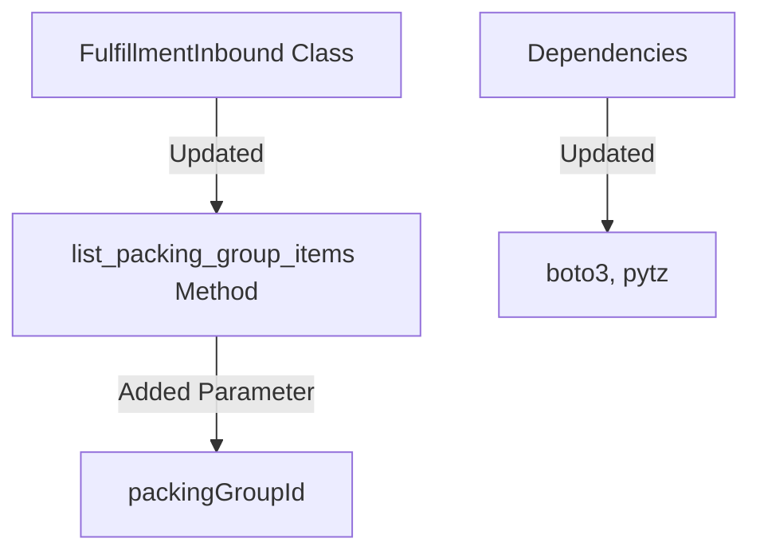

This release includes an important API endpoint update for more precise data retrieval and updates to dependencies for enhanced stability and security.

## v1.9.11 - 2025-01-25
## v1.9.11

### Changes Relevant to End-Users
- **API Endpoint Update**: The `list_packing_group_items` method in the `FulfillmentInbound` class now requires a `packingGroupId` parameter. This change ensures more precise retrieval of packing group items by specifying the packing group directly.

### Internal Changes
- **Dependency Updates**: Updated several dependencies to their latest versions for improved performance and security:
  - `boto3` updated from `1.35.85` to `1.36.5`
  - `cachetools` updated from `5.5.0` to `5.5.1`
  - `setuptools` updated from `75.6.0` to `75.8.0`

### Mermaid Diagram Representation

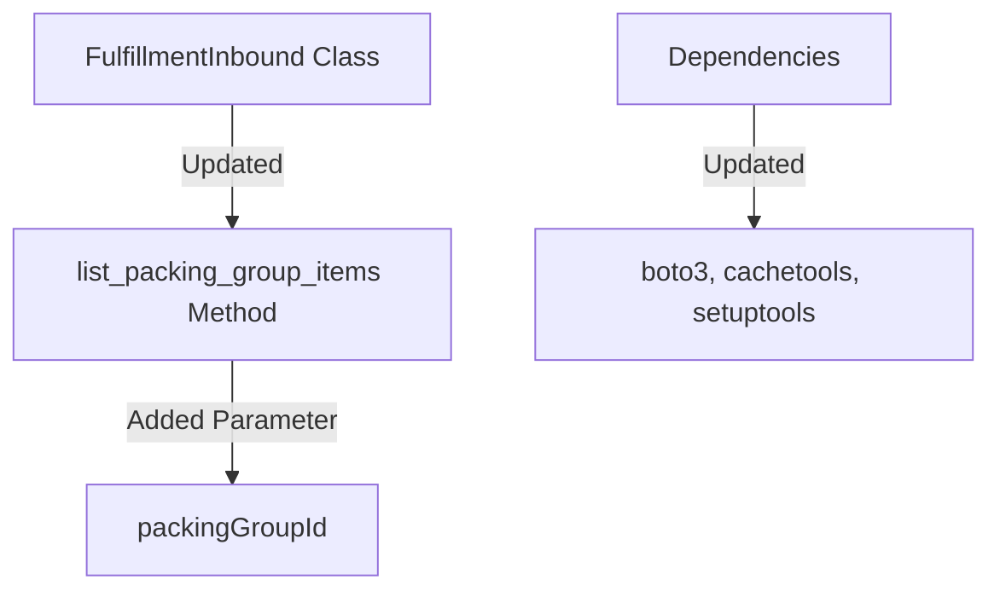

This release includes an important API endpoint update for more precise data retrieval and updates to dependencies for enhanced stability and security.

## v1.9.10 - 2024-12-22
## v1.9.10

### Changes Relevant to End-Users
- **Enhanced Error Logging**: Improved error logging in the `Client` class by changing error messages from debug to error level. This ensures that error responses are more visible and easier to track in logs.

### Internal Changes
- **Debug Logging Addition**: Added a debug log statement to capture the response data before list handling in the `Client` class. This helps in tracing the response content during the debugging process.

### Mermaid Diagram Representation

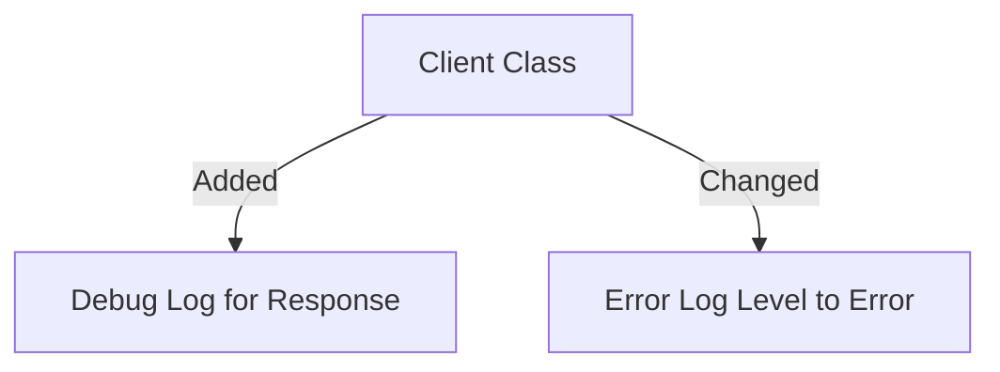

This release enhances error visibility and adds additional debug logging to aid in the development and debugging process.

## v1.9.9 - 2024-12-22
## v1.9.9

### Changes Relevant to End-Users
- **Improved Logging in `Client` Class**: Enhanced the logging functionality within the `Client` class to provide more detailed debug information. This includes logging HTTP methods, request URLs, parameters, data, headers, and error responses. This improvement aids in better tracing and debugging of API requests.

- **Removal of Donation Message**: The donation message that previously displayed upon client initialization has been removed. This change streamlines the user experience by eliminating unsolicited messages during API usage.

### Internal Changes
- **Logging Level Adjustment**: The default logging level for the `Client` class has been set to `INFO`. Users can override this setting externally, allowing for flexible logging configurations.

### Mermaid Diagram Representation

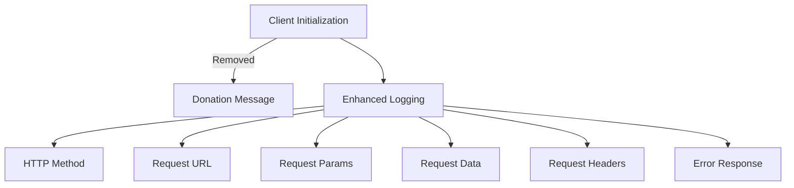

This release focuses on improving the logging capabilities for better debugging and removing non-essential output for a cleaner user experience.

## v1.9.8 - 2024-12-20
## v1.9.8

### Changes Relevant to End-Users
- **Bug Fix in `load_all_pages` Utility**: Corrected indentation issues within the `load_all_pages` function, specifically addressing the handling of the `next_token_only` parameter. This fix ensures that pagination in API requests is managed more reliably, enhancing the function's robustness and accuracy.

### Internal Changes
- No internal changes were made in this release.

### Mermaid Diagram Representation

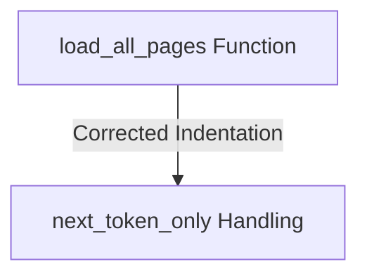

This update addresses a critical bug in the `load_all_pages` utility, ensuring that the function behaves as expected when managing pagination, particularly when the `next_token_only` parameter is utilized.

## v1.9.7 - 2024-12-20
## v1.9.7

### Changes Relevant to End-Users
- **Improvement in `load_all_pages` Utility**: Fixed indentation issues in the `load_all_pages` function to ensure correct behavior when using the `next_token_only` parameter. This change enhances the reliability of the function when handling pagination in API requests.

### Internal Changes
- No internal changes were made in this release.

### Mermaid Diagram Representation

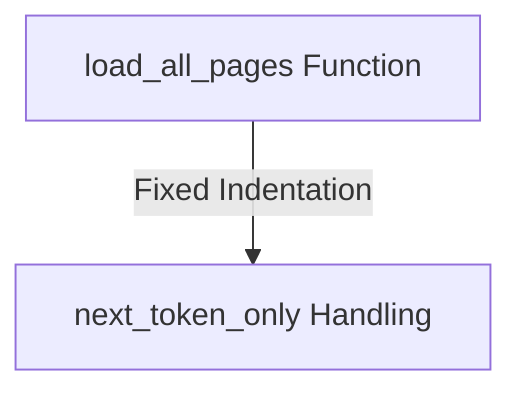

This update ensures that the `load_all_pages` function operates correctly, particularly when the `next_token_only` parameter is used, improving the overall robustness of API interactions.

## v1.9.6 - 2024-12-20
## v1.9.6

### Changes Relevant to End-Users
- **New Feature in `load_all_pages` Utility**: Added a `next_token_only` parameter to the `load_all_pages` function. This allows users to remove all other parameters from `kwargs`, which is particularly useful for the Reports API where only the next token is needed.

### Internal Changes
- **Dependency Update**: Updated `boto3` from version `1.35.81` to `1.35.85` in both `requirements.txt` and `docs/requirements.txt` to ensure compatibility with the latest AWS services and features.

### Mermaid Diagram Representation

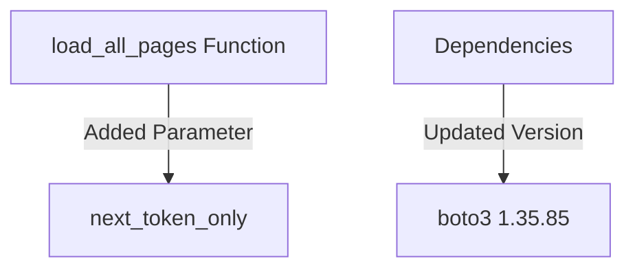

These updates enhance the flexibility of the `load_all_pages` utility function, making it more adaptable for specific API interactions, and ensure the library remains up-to-date with AWS service changes.

## v1.9.5 - 2024-12-16
## v1.9.5

### Changes Relevant to End-Users
- **Vendor Shipments API Enhancement**: Improved the documentation for `submit_shipment_confirmations` and `submit_shipments` methods in the `VendorShipments` class. The descriptions are now more concise and easier to understand, aiding developers in implementing shipment confirmations and requests more effectively.

### Internal Changes
- **Code Cleanup**: Removed unnecessary blank lines in the `VendorShipments` class to enhance code readability and maintainability.
- **Documentation Update**: Added `onerror` attribute to image tags in the documentation templates to ensure fallback images are displayed if the original images fail to load.
- **Template IDs Update**: Updated the list of template IDs in the documentation layout script to remove unused entries and streamline the selection process.

### Mermaid Diagram Representation

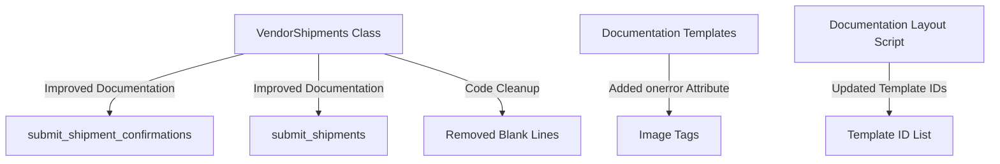

These updates streamline the process of interacting with the Vendor Shipments API, making it more intuitive for developers to use the library, and improve the robustness of the documentation display.

## v1.9.4 - 2024-12-16
## v1.9.4

### Changes Relevant to End-Users
- **Vendor Shipments API Enhancement**: Improved the documentation for `submit_shipment_confirmations` and `submit_shipments` methods in the `VendorShipments` class. The descriptions are now more concise and easier to understand, aiding developers in implementing shipment confirmations and requests more effectively.

### Internal Changes
- **Code Cleanup**: Removed unnecessary blank lines in the `VendorShipments` class to enhance code readability and maintainability.
- **Documentation Update**: Added `onerror` attribute to image tags in the documentation templates to ensure fallback images are displayed if the original images fail to load.

### Mermaid Diagram Representation

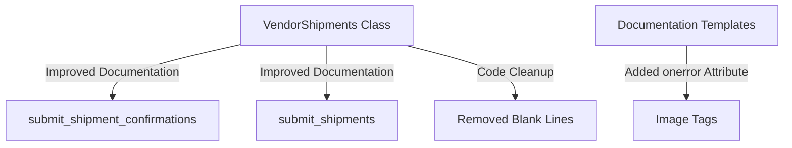

These updates streamline the process of interacting with the Vendor Shipments API, making it more intuitive for developers to use the library, and improve the robustness of the documentation display.

## v1.9.3 - 2024-12-16
## v1.9.3

### Changes Relevant to End-Users
- **Vendor Shipments API Enhancement**: Improved the documentation for `submit_shipment_confirmations` and `submit_shipments` methods in the `VendorShipments` class. The descriptions are now more concise and easier to understand, aiding developers in implementing shipment confirmations and requests more effectively.

### Internal Changes
- **Code Cleanup**: Removed unnecessary blank lines in the `VendorShipments` class to enhance code readability and maintainability.

### Mermaid Diagram Representation

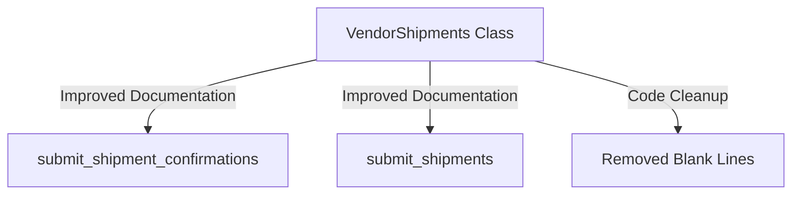

These updates streamline the process of interacting with the Vendor Shipments API, making it more intuitive for developers to use the library.

## v1.9.2 - 2024-12-16
## v1.9.2

### Changes Relevant to End-Users
- **Vendor Shipments API Enhancement**: Improved the documentation for `submit_shipment_confirmations` and `submit_shipments` methods in the `VendorShipments` class. The descriptions are now more concise and easier to understand, aiding developers in implementing shipment confirmations and requests more effectively.

### Internal Changes
- **Code Cleanup**: Removed unnecessary blank lines in the `VendorShipments` class to enhance code readability and maintainability.

### Mermaid Diagram Representation


These updates streamline the process of interacting with the Vendor Shipments API, making it more intuitive for developers to use the library.

## v1.9.1 - 2024-12-14
## v1.9.1

### Changes Relevant to End-Users
- **Vendor Shipments API Enhancement**: Improved the documentation for `submit_shipment_confirmations` and `submit_shipments` methods in the `VendorShipments` class. The descriptions are now more concise and easier to understand, aiding developers in implementing shipment confirmations and requests more effectively.

### Internal Changes
- **Code Cleanup**: Removed unnecessary blank lines in the `VendorShipments` class to enhance code readability and maintainability.

### Mermaid Diagram Representation


These updates streamline the process of interacting with the Vendor Shipments API, making it more intuitive for developers to use the library.

## v1.8.22 - 2024-12-14
## v1.8.22

### Changes Relevant to End-Users
- **Code Style Improvement**: Updated the codebase to use consistent string quoting style, improving readability and maintainability.

### Internal Changes
- **Refactoring**: Reformatted code to adhere to PEP 8 standards, including consistent use of double quotes for strings and improved indentation.
- **Function Signatures**: Updated function signatures for better clarity and consistency across the codebase.

### Mermaid Diagram Representation

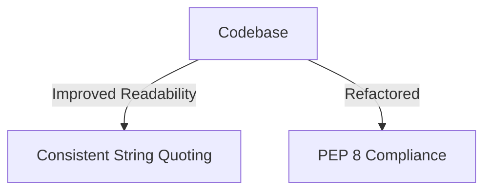

These changes enhance the code quality, making it easier for developers to maintain and extend the library.

## v1.8.21 - 2024-12-14
## v1.8.21

### Changes Relevant to End-Users
- **Configuration Enhancement**: Made the TTL (Time-To-Live) for authentication cache configurable via the `SP_API_AUTH_CACHE_TTL` environment variable. This allows users to customize the cache duration according to their needs, providing greater flexibility in managing token lifetimes.

### Internal Changes
- No internal changes were made in this version.

### Mermaid Diagram Representation

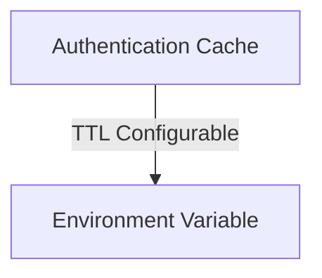

These changes allow users to better manage their authentication cache settings, enhancing the adaptability of the library to different operational requirements.

## v1.8.20 - 2024-12-14
## v1.8.20

### Internal Changes
- Enhanced the changelog generation script to include mermaid diagrams for visual representation of changes.
- Increased the `max_tokens` parameter for OpenAI API calls from 500 to 750 to allow for more detailed changelog entries.

### Mermaid Diagram Representation

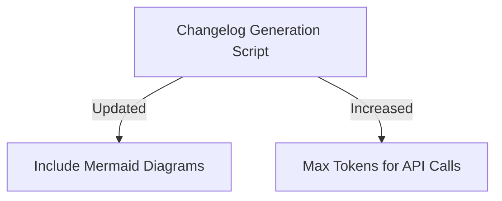

These changes improve the clarity and detail of the changelog entries, providing better insights into updates and modifications.

## v1.8.19 - 2024-12-14
## v1.8.19

### Internal Changes
- Updated the dependabot configuration to check for updates daily instead of weekly.
- Modified the GitHub Actions workflow to exclude dependabot from triggering certain steps, ensuring that version increments and changelog updates are only performed by human contributors.

## v1.8.17 - 2024-12-14
## v1.8.17

### Internal Changes

- Updated the version number to 1.8.17 in the `__version__.py` file.
- Changed the Dependabot update schedule from daily to weekly in `.github/dependabot.yml` for better management of dependency updates.

## v1.8.16 - 2024-12-14
## v1.8.16

### Internal Changes

- Updated the `generate_changelog.py` script to remove backticks from the generated changelog entry, ensuring cleaner formatting.
- Bumped the version number to 1.8.16 in the `__version__.py` file.

## v1.8.15 - 2024-12-14
```markdown
## v1.8.15

### Internal Changes

- Improved the GitHub Actions workflow for version increments:
  - The changelog entry is now written to a temporary file before being appended to the existing `CHANGELOG.md`, ensuring a cleaner update process.
  - Enhanced the method for setting the output of the changelog entry in the workflow, replacing the deprecated `set-output` command with a more robust approach.
- Updated the `generate_changelog.py` script to ensure the changelog entry generation process adheres to the latest guidelines, specifically excluding dates and release status from entries.
```

## v1.8.14 - 2024-12-14
## v1.8.14

### Internal Changes

- Improved the GitHub Actions workflow for version increments:
  - The changelog entry is now written to a temporary file before being appended to the existing `CHANGELOG.md`, ensuring a cleaner update process.
  - Enhanced the method for setting the output of the changelog entry in the workflow, replacing the deprecated `set-output` command with a more robust approach.
- Updated the `generate_changelog.py` script to ensure the changelog entry generation process adheres to the latest guidelines, specifically excluding dates and release status from entries.

## v1.8.12 - 2024-12-14
# Changelog

## v1.8.12

### Internal Changes

- Updated the version increment workflow to simplify the condition for updating `CHANGELOG.md`. The check for non-empty `diff` output has been removed, and now it only checks if `env.new_version` is not empty. This change streamlines the workflow process for updating the changelog.

## v1.8.13 - 2024-12-14
# Changelog

## v1.8.13 - 2023-10-XX

### Internal Changes

- Enhanced the GitHub Actions workflow for version increments. The process now includes reading the changelog entry from a file and using it as the body of the release notes. This improvement ensures that the release notes are automatically populated with the latest changelog entry.
- Re-enabled the steps for creating a new GitHub release and triggering the release workflow. The workflow now checks if `env.new_version` is not empty before proceeding, improving the automation of the release process.
# Changelog

## v1.8.0

### New Features
- **Fulfillment Inbound API**: Added `list_shipment_boxes` method to provide a paginated list of box packages in a shipment.
- **Fulfillment Inbound API**: Added `update_shipment_tracking_details` method to update a shipment's tracking details.
- **Marketplaces**: Added support for the Amazon marketplace in Ireland (IE).

### Dependency Updates
- Updated `boto3` dependency from `~=1.35.67` to `~=1.35.80`.

### Internal Changes
- Updated the `setup.cfg` to include the `name` field for the package metadata.
- Modified the GitHub Actions workflow to ensure `setuptools`, `wheel`, and `twine` are upgraded during the installation process.

# Changelog

## v1.6.1 - v1.7.1

### New Features
- **Amazon Warehousing and Distribution (AWD) API**: Added new endpoint `AmazonWarehousingAndDistribution` with versioning support.
- **Shipping V2 API**: Introduced a new `Shipping` API client with multiple endpoints including `get_rates`, `purchase_shipment`, `one_click_shipment`, `get_tracking`, `cancel_shipment`, `get_access_points`, `submit_ndr_feedback`, and more.
- **Listings Items API**: Added `search_listings_items` endpoint to search and return a list of listings items and their details.
- **Sellers API**: Added `get_account` endpoint to retrieve seller account information and associated marketplaces.
- **Fulfillment Inbound API**: Added multiple new endpoints for managing inbound plans, shipments, and delivery windows.
- **Reports API**: Enhanced iterable handling for `reportTypes`, `processingStatuses`, and `marketplaceIds` parameters to exclude strings.

### Enhancements
- **Versioning Support**: Introduced versioning for clients with multiple versions, allowing users to specify the version when constructing a new client.
- **Documentation**: Updated and expanded documentation, including new sections for versioning and endpoints.
- **Security**: Added a `SECURITY.md` file outlining the security policy and vulnerability reporting process.
- **README**: Enhanced with new badges, support options, and improved documentation links.

### Bug Fixes
- **Inventories API**: Fixed an issue with `sellerSkus` parameter to ensure it is properly handled as an iterable, excluding strings.
- **Listings Items API**: Corrected handling of `includedData` parameter to ensure it is properly processed as an iterable, excluding strings.
- **Reports API**: Fixed iterable handling for parameters to ensure proper processing when not a string.

### Internal Changes
- **CI/CD**: Added a new GitHub Actions workflow for version incrementing and release creation.
- **Dependencies**: Updated dependencies in `requirements.txt` and `docs/requirements.txt` to newer versions.
- **Code Quality**: Removed SonarCloud configuration file and associated badges from the README.
- **Testing**: Added new tests for `Shipping V2` and `Listings Items` APIs to ensure functionality and reliability.

This release introduces significant new features, enhancements, and bug fixes to improve the functionality and usability of the `python-amazon-sp-api` library.

# Changelog

## v1.6.0

### New Features
- **Amazon Warehousing and Distribution API**: Added a new client for the Amazon Warehousing and Distribution (AWD) API. This includes endpoints for:
  - Retrieving an AWD inbound shipment.
  - Listing inbound AWD shipments with optional filters.
  - Listing AWD inventory with optional filters.

### Changes
- **Data Kiosk API**: Updated the request handling to include `add_marketplace=False` for several endpoints, ensuring marketplace information is not added to these requests.
- **Feeds API**: Improved the `get_feed_result_document` method to clarify that it fetches the feed result document's contents by first retrieving from the `getFeedDocument` endpoint and then fetching from the returned URL. Updated the return type to `str`.

### Bug Fixes
- **Access Token Response**: Corrected the `expires_in` attribute to correctly retrieve the expiration time from the response.
- **ApiResponse**: Enhanced the `next_token` property to also check for `nextPageToken` in the response payload.

### Internal
- **Dependencies**: Updated `requests` to version `2.32.3` and `boto3` to version `1.34.144` in both `requirements.txt` and `docs/requirements.txt`.
- **Client Initialization**: Added a donation message during client initialization to encourage support for the project. This message can be disabled by setting the `ENV_DISABLE_DONATION_MSG=1` environment variable.

# Changelog

## [v1.5.0]

### New Features
- **FulfillmentInbound API**: Added support for the new FulfillmentInbound API version `2024-03-20`, including:
  - `list_inbound_plans`
  - `create_inbound_plan`
  - `get_inbound_plan`
  - `list_inbound_plan_boxes`
  - `cancel_inbound_plan`
  - `list_inbound_plan_items`
  - `set_packing_information`
  - `list_packing_options`
  - `generate_packing_options`
  - `confirm_packing_option`
  - `list_packing_group_items`
  - `list_inbound_plan_pallets`
  - `list_placement_options`
  - `generate_placement_options`
  - `confirm_placement_option`
  - `get_shipment`
  - `get_delivery_challan_document`
  - `update_shipment_delivery_window`
  - `get_self_ship_appointment_slots`
  - `generate_self_ship_appointment_slots`
  - `cancel_self_ship_appointment`
  - `schedule_self_ship_appointment`
  - `update_shipment_tracking_details`
  - `list_transportation_options`
  - `generate_transportation_options`
  - `confirm_transportation_options`
  - `list_item_compliance_details`
  - `update_item_compliance_details`
  - `get_inbound_operation_status`

### Changes
- **Catalog API**: Reduced the burst rate limit from 40 to 2 requests per second.
- **Feeds API**: Fixed encoding issue by changing `upload_data.decode('iso-8859-1')` to `upload_data.encode('iso-8859-1')`.

### Bug Fixes
- **DataKiosk API**: Improved file handling in `_handle_file` method to correctly handle both bytes and string documents.

### Dependencies
- Updated `boto3` from `1.34.2` to `1.34.87`.
- Updated `cachetools` from `5.3.2` to `5.3.3`.

# Changelog

## v1.4.0

### New Features
- **Application Management API**: Added a new client for the Application Management API, allowing developers to programmatically update the client secret on registered applications. This includes the `rotate_application_client_secret` method to rotate application client secrets.
- **Enums Documentation**: Introduced documentation for various enums used within the API, such as `Marketplaces`, `FeedTypes`, `FulfillmentChannels`, and more.

### Changes
- **Listings Items API**: Updated the `get_listings_item` method to handle `includedData` as an iterable, converting it to a comma-separated string if necessary.
- **Documentation Updates**: 
  - Removed consultation and playground sections from the README.
  - Removed API documentation buttons from various endpoint documentation pages.
  - Added `enums` section to the documentation index for better visibility of available enums.
- **Dependencies**: Updated `boto3` dependency from `1.29.3` to `1.34.2`.

### Internal Changes
- **Code Cleanup**: Commented out unused sections in the documentation footer and layout templates.
- **Enum Enhancements**: Improved enum classes by adding string inheritance and documentation comments for better clarity and usage.
- **Documentation Build**: Added new Sphinx extensions to support enum documentation and compatibility.

These changes enhance the functionality and usability of the `python-amazon-sp-api` package, providing developers with more tools and clearer documentation for integrating with Amazon's Selling Partner API.

# Changelog

## v1.3.0

### New Features
- **Data Kiosk API Support**: Added support for the Data Kiosk API, allowing users to create and manage queries for sales and traffic analytics. Introduced the `DataKiosk` client with methods such as `create_query`, `get_document`, and others for interacting with the Data Kiosk API.
- **New Endpoints**: Added new endpoints for `data_kiosk`, `replenishment`, and `supply_sources` in the documentation.
- **AWS Secret Manager Authentication**: Introduced optional installation for AWS Secret Manager Authentication with `pip install "python-amazon-sp-api[aws]"` and caching support with `pip install "python-amazon-sp-api[aws-caching]"`.

### Changes
- **Dependencies**: Updated `boto3` dependency from `~=1.29.2` to `~=1.29.3`.
- **Rate Limit Documentation**: Improved the documentation format for rate limits in the Data Kiosk API to use tables for better readability.

### Notifications
- **New Notification Type**: Added `DATA_KIOSK_QUERY_PROCESSING_FINISHED` notification type to notify when a Data Kiosk query finishes processing.

# Changelog

## v1.2.0

### New Features
- **Data Kiosk API**: Introduced a new `data_kiosk` module to interact with Amazon's Data Kiosk API.
  - Added `get_document` method with enhanced functionality:
    - Supports downloading documents directly by setting the `download` parameter to `True`.
    - Allows writing the document to a specified file using the `file` parameter, which accepts `BytesIO`, `StringIO`, `BinaryIO`, or `TextIO`.
    - Added support for specifying file encoding via the `encoding` parameter, defaulting to `utf-8`.

- **New APIs**: Added new modules for:
  - `replenishment`
  - `supply_sources`

### Internal Changes
- Updated project version from `1.1.0` to `1.2.0`.

# Changelog

## v1.0.0

### Breaking Changes
- **Authentication Update**: Removed AWS IAM or AWS Signature Version 4 authentication. The library no longer requires AWS credentials for standard operations. AWS credentials can still be passed but will be ignored unless using SecretsManager Auth.

### Enhancements
- **Datetime Handling**: Improved the datetime formatting in the `Sales` API to use `isoformat` with timezone awareness, ensuring consistent and accurate timestamp representation.

### Dependency Updates
- Updated `boto3` to version `1.28.63`.
- Updated `setuptools` to version `68.2.2`.

### Internal Changes
- Removed the `aws_sig_v4.py` module, along with related AWS signature authentication logic from the `client.py` file.
- Added `.readthedocs.yaml` configuration file to support building documentation with Read the Docs.

