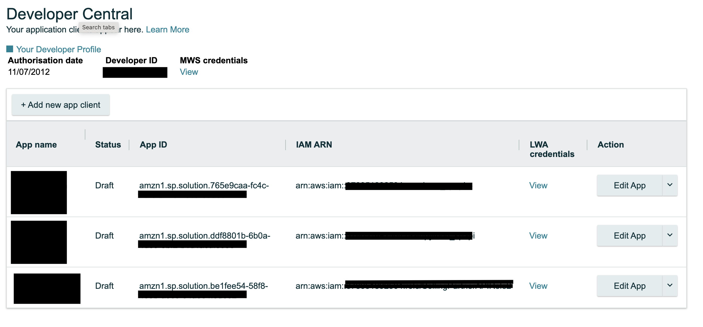
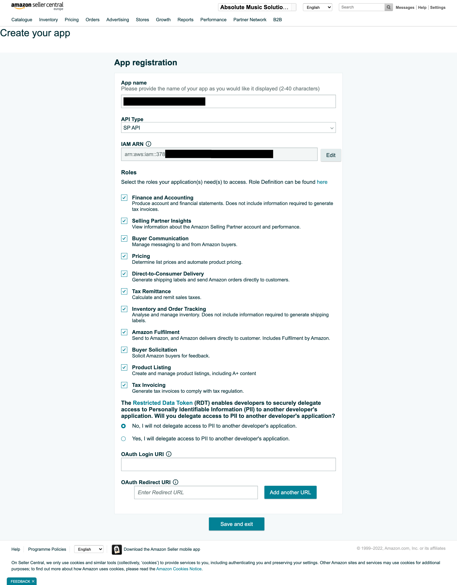
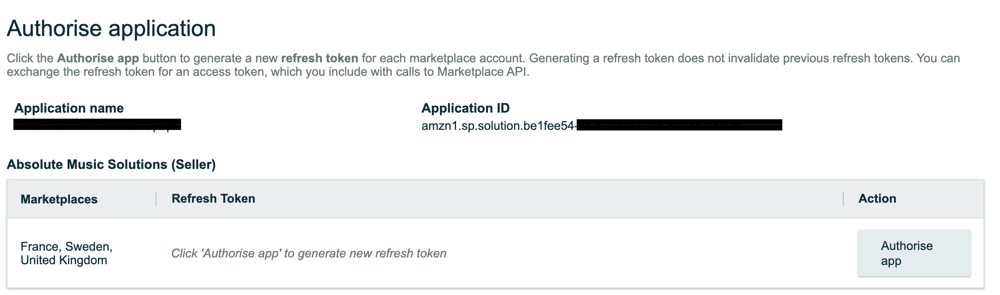
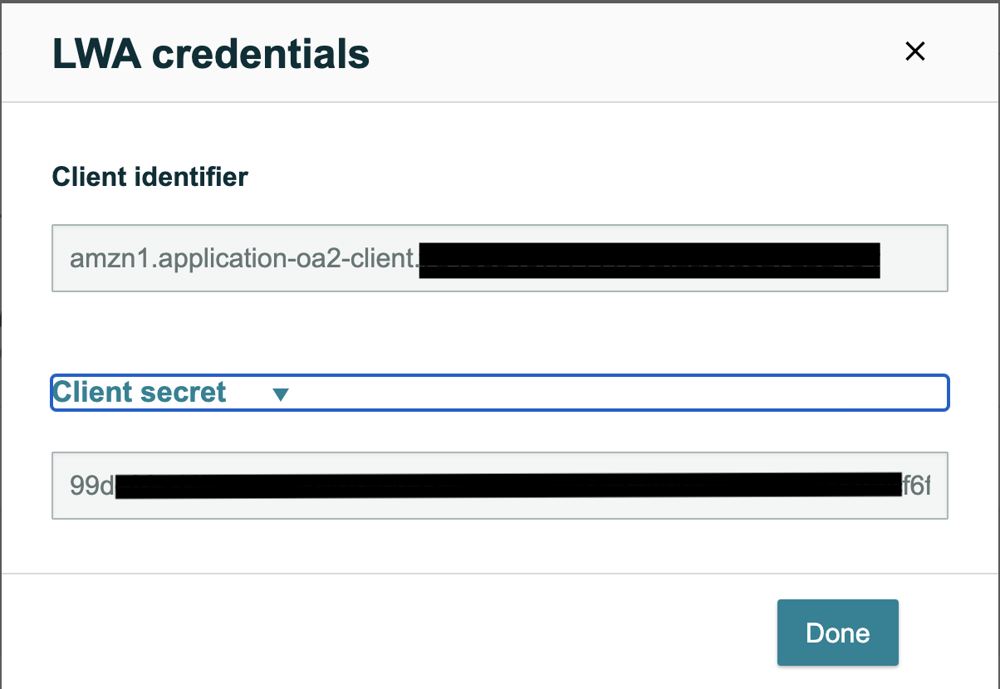

Initial Authorisation
=====================

Internal Seller Access
----------------------

To gain initial access to the Api you will need to follow the authorisation process as documented by
Amazon https://github.com/amzn/selling-partner-api-docs/blob/main/guides/en-US/developer-guide/SellingPartnerApiDeveloperGuide.md

This involves three main stages:

- Configuring AWS IAM to have User, Role and Permissions for SPAPI
- Adding an App to your Seller Central account.
- Configuring Python-SPAPI with the correct credentials.

Configuring AWS IAM:
^^^^^^^^^^^^^^^^^^^^

   1. Create an IAM User
   2. Create an IAM Policy
   3. Create an IAM Role
   4. Add an AWS Security Token Service (STS) policy to the IAM User

.. note::
    This guide assumes you have used the ROLE for attaching the permissions policy to as per the SPAPI quick start guide from Amazon

Make sure you take note of the following items before progressing to the App setup in Seller Central:

- User ARN
- Role ARN
- AWS Access Key
- AWS Secret Key

There is the option to download the `new user credentials` - this will give you a CSV file of the `Access Key` and `Secret Key`

.. warning::
    You will only get one chance to view the Secret key

Configuring the App in Seller Central:
^^^^^^^^^^^^^^^^^^^^^^^^^^^^^^^^^^^^^^

.. note::
    **To add an App to your Seller central account you must be logged in the account owner.**

Overview:

- Seller Central -> Partner Network -> Develop Apps.
- Add a new client app
- Add in the IAM *ROLE* that you attached the execute permissions to.
    - Select the necessary permissions for your app.
    - The OAUTH details are not required (for self certification apps)
- Click the `LWA Credentials View` link to see your `Login With Amazon` credentials.
- Click *Authorise* and copy the `REFRESH_TOKEN` that is provided to you. *This is your only chance to see this token!, you will nee to regenerate it if you lose it.*

Configuring Python SPAPI.
^^^^^^^^^^^^^^^^^^^^^^^^^

Using the credentials dict as our example (Note you can use file or environment variables):

The following is an overview of which credentials go with which key.

- `refresh_token` -> This is from Seller Central, Authorisation of the app window
- `lws_app_id` -> This is from Seller central under LWA client credentials -> Client Identifier and will look like `amzn1.application-oa2-client.7b18cd......`
- `lwa_client_secret` -> This is from Seller central under LWA client credentials -> Client Secret and will look like `b5f7f8...`
- `aws_access_key` -> From AWS IAM Setup (Downloaded in the `new_user_credentials.csv`) and is called `Access key ID`
- `aws_secret_key` -> From AWS IAM Setup (Downloaded in the `new_user_credentials.csv`) and is called `Secret access key`
- `role_arn` is from the AWS IAM Setup and is the ARN of the ROLE and will look like `arn:aws:iam::1234567890:role/SellingPartnerAPIRole`

.. code-block:: python

    credentials = dict(
        refresh_token='your_refresh_token',  # From Seller central under Authorise -> Refresh Token
        lwa_app_id='your_lwa_app_id',  # From Seller Central, named CLIENT IDENTIFIER on website.
        lwa_client_secret='your_lwa_client_secret',  # From Seller Central, named CLIENT SECRET on website.
        aws_access_key='your_aws_access_key',  # From AWS IAM Setup
        aws_secret_key='your_aws_secret_key',  # From AWS IAM Setup
        role_arn='your_role_arn'  #arn:aws:iam::1234567890:role/SellingPartnerAPIRole
    )

.. note::
    In this example we used the IAM ROLE to configure the app in Seller Central, so we must also use the ROLE Arn to configure the Python SPAPI.
    Should you have chosen an alternate setup, you may need to drop the `role_arn` from your configuration.

**Example Screenshots**

*App Overview*

On this screen you can both create a new app, gain your LWA credentials for an existing app, and authorise your app (get refresh token).

**Create Application**

**Authorise Application**

**LWA Credentials View**

